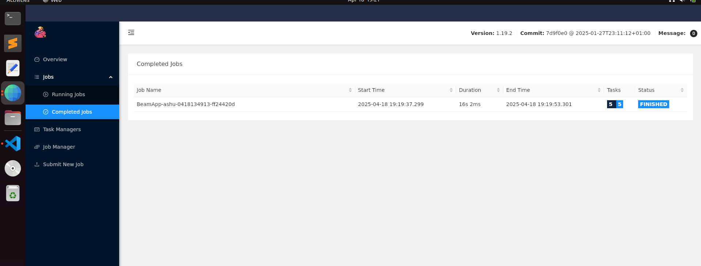

(beamenv) Ubuntu-VM% python3 -m apache_beam.yaml.main --yaml_pipeline_file=pipeline.yaml
INFO:root:Missing pipeline option (runner). Executing pipeline using the default runner: DirectRunner.
Building pipeline...
INFO:apache_beam.yaml.yaml_transform:Expanding "Create" at line 3 
INFO:apache_beam.yaml.yaml_transform:Expanding "LogForTesting" at line 6 
Running pipeline...
INFO:apache_beam.runners.worker.statecache:Creating state cache with size 104857600
INFO:root:{"element": 1}
INFO:root:{"element": 2}
INFO:root:{"element": 3}
(beamenv) Ubuntu-VM% 

(beamenv) Ubuntu-VM% python3 -m apache_beam.yaml.main --yaml_pipeline_file=pipeline.yaml --runner=FlinkRunner --flink_master=localhost:8081                            
Building pipeline...
INFO:apache_beam.yaml.yaml_transform:Expanding "Create" at line 3 
INFO:apache_beam.yaml.yaml_transform:Expanding "LogForTesting" at line 6 
Running pipeline...
INFO:apache_beam.runners.portability.flink_runner:Adding HTTP protocol scheme to flink_master parameter: http://localhost:8081
INFO:apache_beam.utils.subprocess_server:Downloading job server jar from https://repo.maven.apache.org/maven2/org/apache/beam/beam-runners-flink-1.19-job-server/2.64.0/beam-runners-flink-1.19-job-server-2.64.0.jar
INFO:apache_beam.utils.subprocess_server:Starting service with ('java' '-jar' '/home/ashu/.apache_beam/cache/jars/beam-runners-flink-1.19-job-server-2.64.0.jar' '--flink-master' 'http://localhost:8081' '--artifacts-dir' '/tmp/beam-tempf1mqw7ob/artifactsg0c1t1m0' '--job-port' '36683' '--artifact-port' '0' '--expansion-port' '0')
INFO:apache_beam.utils.subprocess_server:SLF4J(W): Class path contains multiple SLF4J providers.
INFO:apache_beam.utils.subprocess_server:SLF4J(W): Found provider [org.slf4j.jul.JULServiceProvider@3e3abc88]
INFO:apache_beam.utils.subprocess_server:SLF4J(W): Found provider [org.slf4j.simple.SimpleServiceProvider@6ce253f1]
INFO:apache_beam.utils.subprocess_server:SLF4J(W): See https://www.slf4j.org/codes.html#multiple_bindings for an explanation.
INFO:apache_beam.utils.subprocess_server:SLF4J(I): Actual provider is of type [org.slf4j.jul.JULServiceProvider@3e3abc88]
WARNING:root:Waiting for grpc channel to be ready at localhost:36683.
WARNING:root:Waiting for grpc channel to be ready at localhost:36683.
WARNING:root:Waiting for grpc channel to be ready at localhost:36683.
INFO:apache_beam.utils.subprocess_server:Apr 18, 2025 6:59:06 PM org.apache.beam.runners.jobsubmission.JobServerDriver createArtifactStagingService
INFO:apache_beam.utils.subprocess_server:INFO: ArtifactStagingService started on localhost:42413
INFO:apache_beam.utils.subprocess_server:Apr 18, 2025 6:59:06 PM org.apache.beam.runners.jobsubmission.JobServerDriver createExpansionService
INFO:apache_beam.utils.subprocess_server:INFO: Java ExpansionService started on localhost:36933
INFO:apache_beam.utils.subprocess_server:Apr 18, 2025 6:59:06 PM org.apache.beam.runners.jobsubmission.JobServerDriver createJobServer
INFO:apache_beam.utils.subprocess_server:INFO: JobService started on localhost:36683
INFO:apache_beam.utils.subprocess_server:Apr 18, 2025 6:59:06 PM org.apache.beam.runners.jobsubmission.JobServerDriver run
INFO:apache_beam.utils.subprocess_server:INFO: Job server now running, terminate with Ctrl+C
WARNING:root:Waiting for grpc channel to be ready at localhost:36683.
INFO:apache_beam.utils.subprocess_server:Apr 18, 2025 6:59:07 PM org.apache.beam.runners.fnexecution.artifact.ArtifactStagingService$2 onNext
INFO:apache_beam.utils.subprocess_server:INFO: Staging artifacts for job_01ddddf3-3e4f-49e2-b378-4b7b796e9e68.
INFO:apache_beam.utils.subprocess_server:Apr 18, 2025 6:59:07 PM org.apache.beam.runners.fnexecution.artifact.ArtifactStagingService$2 resolveNextEnvironment
INFO:apache_beam.utils.subprocess_server:INFO: Resolving artifacts for job_01ddddf3-3e4f-49e2-b378-4b7b796e9e68.0:ref_Environment_default_environment_1.
INFO:apache_beam.utils.subprocess_server:Apr 18, 2025 6:59:07 PM org.apache.beam.runners.fnexecution.artifact.ArtifactStagingService$2 onNext
INFO:apache_beam.utils.subprocess_server:INFO: Getting 1 artifacts for job_01ddddf3-3e4f-49e2-b378-4b7b796e9e68.null.
INFO:apache_beam.utils.subprocess_server:Apr 18, 2025 6:59:07 PM org.apache.beam.runners.fnexecution.artifact.ArtifactStagingService$2 finishStaging
INFO:apache_beam.utils.subprocess_server:INFO: Artifacts fully staged for job_01ddddf3-3e4f-49e2-b378-4b7b796e9e68.
INFO:apache_beam.utils.subprocess_server:Apr 18, 2025 6:59:08 PM org.apache.beam.runners.flink.FlinkJobInvoker invokeWithExecutor
INFO:apache_beam.utils.subprocess_server:INFO: Invoking job BeamApp-ashu-0418132907-aabd6ae4_6cd0f9c0-a9ca-4d9f-b15c-c4006f9f886d with pipeline runner org.apache.beam.runners.flink.FlinkPipelineRunner@2c5bb605
INFO:apache_beam.utils.subprocess_server:Apr 18, 2025 6:59:08 PM org.apache.beam.runners.jobsubmission.JobInvocation start
INFO:apache_beam.utils.subprocess_server:INFO: Starting job invocation BeamApp-ashu-0418132907-aabd6ae4_6cd0f9c0-a9ca-4d9f-b15c-c4006f9f886d
INFO:apache_beam.utils.subprocess_server:Apr 18, 2025 6:59:08 PM org.apache.beam.runners.flink.FlinkPipelineRunner runPipelineWithTranslator
INFO:apache_beam.utils.subprocess_server:INFO: Translating pipeline to Flink program.
INFO:apache_beam.utils.subprocess_server:Apr 18, 2025 6:59:08 PM org.apache.beam.runners.flink.FlinkExecutionEnvironments createBatchExecutionEnvironment
INFO:apache_beam.utils.subprocess_server:INFO: Creating a Batch Execution Environment.
INFO:apache_beam.runners.portability.portable_runner:Job state changed to STOPPED
INFO:apache_beam.runners.portability.portable_runner:Job state changed to STARTING
INFO:apache_beam.runners.portability.portable_runner:Job state changed to RUNNING
INFO:apache_beam.utils.subprocess_server:Apr 18, 2025 6:59:08 PM org.apache.beam.runners.flink.FlinkExecutionEnvironments createBatchExecutionEnvironment
INFO:apache_beam.utils.subprocess_server:INFO: Using Flink Master URL localhost:8081.
INFO:apache_beam.utils.subprocess_server:Apr 18, 2025 6:59:15 PM org.apache.flink.api.java.utils.PlanGenerator logTypeRegistrationDetails
INFO:apache_beam.utils.subprocess_server:INFO: The job has 0 registered types and 0 default Kryo serializers
INFO:apache_beam.utils.subprocess_server:Apr 18, 2025 6:59:15 PM org.apache.flink.client.program.rest.RestClusterClient lambda$submitJob$7
INFO:apache_beam.utils.subprocess_server:INFO: Submitting job 'BeamApp-ashu-0418132907-aabd6ae4' (08f5f7b29f536b88d76d1d99930b4c2e).
INFO:apache_beam.utils.subprocess_server:Apr 18, 2025 6:59:31 PM org.apache.flink.client.program.rest.RestClusterClient lambda$null$6
INFO:apache_beam.utils.subprocess_server:INFO: Successfully submitted job 'BeamApp-ashu-0418132907-aabd6ae4' (08f5f7b29f536b88d76d1d99930b4c2e) to 'http://localhost:8081'.
INFO:apache_beam.utils.subprocess_server:Apr 18, 2025 6:59:46 PM org.apache.beam.runners.jobsubmission.JobInvocation$1 onFailure
INFO:apache_beam.utils.subprocess_server:SEVERE: Error during job invocation BeamApp-ashu-0418132907-aabd6ae4_6cd0f9c0-a9ca-4d9f-b15c-c4006f9f886d.
INFO:apache_beam.utils.subprocess_server:org.apache.flink.client.program.ProgramInvocationException: Job failed (JobID: 08f5f7b29f536b88d76d1d99930b4c2e)
INFO:apache_beam.utils.subprocess_server:       at org.apache.flink.client.deployment.ClusterClientJobClientAdapter.lambda$null$6(ClusterClientJobClientAdapter.java:130)
INFO:apache_beam.utils.subprocess_server:       at java.base/java.util.concurrent.CompletableFuture$UniApply.tryFire(CompletableFuture.java:646)
INFO:apache_beam.utils.subprocess_server:       at java.base/java.util.concurrent.CompletableFuture.postComplete(CompletableFuture.java:510)
INFO:apache_beam.utils.subprocess_server:       at java.base/java.util.concurrent.CompletableFuture.complete(CompletableFuture.java:2147)
INFO:apache_beam.utils.subprocess_server:       at org.apache.flink.util.concurrent.FutureUtils.lambda$retryOperationWithDelay$6(FutureUtils.java:302)
INFO:apache_beam.utils.subprocess_server:       at java.base/java.util.concurrent.CompletableFuture.uniWhenComplete(CompletableFuture.java:863)
INFO:apache_beam.utils.subprocess_server:       at java.base/java.util.concurrent.CompletableFuture$UniWhenComplete.tryFire(CompletableFuture.java:841)
INFO:apache_beam.utils.subprocess_server:       at java.base/java.util.concurrent.CompletableFuture.postComplete(CompletableFuture.java:510)
INFO:apache_beam.utils.subprocess_server:       at java.base/java.util.concurrent.CompletableFuture.complete(CompletableFuture.java:2147)
INFO:apache_beam.utils.subprocess_server:       at org.apache.flink.client.program.rest.RestClusterClient.lambda$pollResourceAsync$35(RestClusterClient.java:901)
INFO:apache_beam.utils.subprocess_server:       at java.base/java.util.concurrent.CompletableFuture.uniWhenComplete(CompletableFuture.java:863)
INFO:apache_beam.utils.subprocess_server:       at java.base/java.util.concurrent.CompletableFuture$UniWhenComplete.tryFire(CompletableFuture.java:841)
INFO:apache_beam.utils.subprocess_server:       at java.base/java.util.concurrent.CompletableFuture.postComplete(CompletableFuture.java:510)
INFO:apache_beam.utils.subprocess_server:       at java.base/java.util.concurrent.CompletableFuture.complete(CompletableFuture.java:2147)
INFO:apache_beam.utils.subprocess_server:       at org.apache.flink.util.concurrent.FutureUtils.lambda$retryOperationWithDelay$6(FutureUtils.java:302)
INFO:apache_beam.utils.subprocess_server:       at java.base/java.util.concurrent.CompletableFuture.uniWhenComplete(CompletableFuture.java:863)
INFO:apache_beam.utils.subprocess_server:       at java.base/java.util.concurrent.CompletableFuture$UniWhenComplete.tryFire(CompletableFuture.java:841)
INFO:apache_beam.utils.subprocess_server:       at java.base/java.util.concurrent.CompletableFuture.postComplete(CompletableFuture.java:510)
INFO:apache_beam.utils.subprocess_server:       at java.base/java.util.concurrent.CompletableFuture.postFire(CompletableFuture.java:614)
INFO:apache_beam.utils.subprocess_server:       at java.base/java.util.concurrent.CompletableFuture$UniCompose.tryFire(CompletableFuture.java:1163)
INFO:apache_beam.utils.subprocess_server:       at java.base/java.util.concurrent.CompletableFuture$Completion.run(CompletableFuture.java:482)
INFO:apache_beam.utils.subprocess_server:       at java.base/java.util.concurrent.ThreadPoolExecutor.runWorker(ThreadPoolExecutor.java:1136)
INFO:apache_beam.utils.subprocess_server:       at java.base/java.util.concurrent.ThreadPoolExecutor$Worker.run(ThreadPoolExecutor.java:635)
INFO:apache_beam.utils.subprocess_server:       at java.base/java.lang.Thread.run(Thread.java:840)
INFO:apache_beam.utils.subprocess_server:Caused by: org.apache.flink.runtime.client.JobExecutionException: Job execution failed.
INFO:apache_beam.utils.subprocess_server:       at org.apache.flink.runtime.jobmaster.JobResult.toJobExecutionResult(JobResult.java:144)
INFO:apache_beam.utils.subprocess_server:       at org.apache.flink.client.deployment.ClusterClientJobClientAdapter.lambda$null$6(ClusterClientJobClientAdapter.java:128)
INFO:apache_beam.utils.subprocess_server:       ... 23 more
INFO:apache_beam.utils.subprocess_server:Caused by: org.apache.flink.runtime.JobException: Recovery is suppressed by NoRestartBackoffTimeStrategy
INFO:apache_beam.utils.subprocess_server:       at org.apache.flink.runtime.executiongraph.failover.ExecutionFailureHandler.handleFailure(ExecutionFailureHandler.java:180)
INFO:apache_beam.utils.subprocess_server:       at org.apache.flink.runtime.executiongraph.failover.ExecutionFailureHandler.getFailureHandlingResult(ExecutionFailureHandler.java:107)
INFO:apache_beam.utils.subprocess_server:       at org.apache.flink.runtime.scheduler.DefaultScheduler.recordTaskFailure(DefaultScheduler.java:277)
INFO:apache_beam.utils.subprocess_server:       at org.apache.flink.runtime.scheduler.DefaultScheduler.handleTaskFailure(DefaultScheduler.java:268)
INFO:apache_beam.utils.subprocess_server:       at org.apache.flink.runtime.scheduler.DefaultScheduler.onTaskFailed(DefaultScheduler.java:261)
INFO:apache_beam.utils.subprocess_server:       at org.apache.flink.runtime.scheduler.SchedulerBase.onTaskExecutionStateUpdate(SchedulerBase.java:787)
INFO:apache_beam.utils.subprocess_server:       at org.apache.flink.runtime.scheduler.SchedulerBase.updateTaskExecutionState(SchedulerBase.java:764)
INFO:apache_beam.utils.subprocess_server:       at org.apache.flink.runtime.scheduler.SchedulerNG.updateTaskExecutionState(SchedulerNG.java:83)
INFO:apache_beam.utils.subprocess_server:       at org.apache.flink.runtime.jobmaster.JobMaster.updateTaskExecutionState(JobMaster.java:488)
INFO:apache_beam.utils.subprocess_server:       at java.base/jdk.internal.reflect.NativeMethodAccessorImpl.invoke0(Native Method)
INFO:apache_beam.utils.subprocess_server:       at java.base/jdk.internal.reflect.NativeMethodAccessorImpl.invoke(Unknown Source)
INFO:apache_beam.utils.subprocess_server:       at java.base/jdk.internal.reflect.DelegatingMethodAccessorImpl.invoke(Unknown Source)
INFO:apache_beam.utils.subprocess_server:       at java.base/java.lang.reflect.Method.invoke(Unknown Source)
INFO:apache_beam.utils.subprocess_server:       at org.apache.flink.runtime.rpc.pekko.PekkoRpcActor.lambda$handleRpcInvocation$1(PekkoRpcActor.java:309)
INFO:apache_beam.utils.subprocess_server:       at org.apache.flink.runtime.concurrent.ClassLoadingUtils.runWithContextClassLoader(ClassLoadingUtils.java:83)
INFO:apache_beam.utils.subprocess_server:       at org.apache.flink.runtime.rpc.pekko.PekkoRpcActor.handleRpcInvocation(PekkoRpcActor.java:307)
INFO:apache_beam.utils.subprocess_server:       at org.apache.flink.runtime.rpc.pekko.PekkoRpcActor.handleRpcMessage(PekkoRpcActor.java:222)
INFO:apache_beam.utils.subprocess_server:       at org.apache.flink.runtime.rpc.pekko.FencedPekkoRpcActor.handleRpcMessage(FencedPekkoRpcActor.java:85)
INFO:apache_beam.utils.subprocess_server:       at org.apache.flink.runtime.rpc.pekko.PekkoRpcActor.handleMessage(PekkoRpcActor.java:168)
INFO:apache_beam.utils.subprocess_server:       at org.apache.pekko.japi.pf.UnitCaseStatement.apply(CaseStatements.scala:33)
INFO:apache_beam.utils.subprocess_server:       at org.apache.pekko.japi.pf.UnitCaseStatement.apply(CaseStatements.scala:29)
INFO:apache_beam.utils.subprocess_server:       at scala.PartialFunction.applyOrElse(PartialFunction.scala:127)
INFO:apache_beam.utils.subprocess_server:       at scala.PartialFunction.applyOrElse$(PartialFunction.scala:126)
INFO:apache_beam.utils.subprocess_server:       at org.apache.pekko.japi.pf.UnitCaseStatement.applyOrElse(CaseStatements.scala:29)
INFO:apache_beam.utils.subprocess_server:       at scala.PartialFunction$OrElse.applyOrElse(PartialFunction.scala:175)
INFO:apache_beam.utils.subprocess_server:       at scala.PartialFunction$OrElse.applyOrElse(PartialFunction.scala:176)
INFO:apache_beam.utils.subprocess_server:       at scala.PartialFunction$OrElse.applyOrElse(PartialFunction.scala:176)
INFO:apache_beam.utils.subprocess_server:       at org.apache.pekko.actor.Actor.aroundReceive(Actor.scala:547)
INFO:apache_beam.utils.subprocess_server:       at org.apache.pekko.actor.Actor.aroundReceive$(Actor.scala:545)
INFO:apache_beam.utils.subprocess_server:       at org.apache.pekko.actor.AbstractActor.aroundReceive(AbstractActor.scala:229)
INFO:apache_beam.utils.subprocess_server:       at org.apache.pekko.actor.ActorCell.receiveMessage(ActorCell.scala:590)
INFO:apache_beam.utils.subprocess_server:       at org.apache.pekko.actor.ActorCell.invoke(ActorCell.scala:557)
INFO:apache_beam.utils.subprocess_server:       at org.apache.pekko.dispatch.Mailbox.processMailbox(Mailbox.scala:272)
INFO:apache_beam.utils.subprocess_server:       at org.apache.pekko.dispatch.Mailbox.run(Mailbox.scala:233)
INFO:apache_beam.utils.subprocess_server:       at org.apache.pekko.dispatch.Mailbox.exec(Mailbox.scala:245)
INFO:apache_beam.utils.subprocess_server:       at java.base/java.util.concurrent.ForkJoinTask.doExec(Unknown Source)
INFO:apache_beam.utils.subprocess_server:       at java.base/java.util.concurrent.ForkJoinPool$WorkQueue.topLevelExec(Unknown Source)
INFO:apache_beam.utils.subprocess_server:       at java.base/java.util.concurrent.ForkJoinPool.scan(Unknown Source)
INFO:apache_beam.utils.subprocess_server:       at java.base/java.util.concurrent.ForkJoinPool.runWorker(Unknown Source)
INFO:apache_beam.utils.subprocess_server:       at java.base/java.util.concurrent.ForkJoinWorkerThread.run(Unknown Source)
INFO:apache_beam.utils.subprocess_server:Caused by: java.lang.Exception: The user defined 'open()' method caused an exception: java.io.IOException: Cannot run program "docker": error=2, No such file or directory
INFO:apache_beam.utils.subprocess_server:       at org.apache.flink.runtime.operators.BatchTask.run(BatchTask.java:510)
INFO:apache_beam.utils.subprocess_server:       at org.apache.flink.runtime.operators.BatchTask.invoke(BatchTask.java:359)
INFO:apache_beam.utils.subprocess_server:       at org.apache.flink.runtime.taskmanager.Task.runWithSystemExitMonitoring(Task.java:958)
INFO:apache_beam.utils.subprocess_server:       at org.apache.flink.runtime.taskmanager.Task.restoreAndInvoke(Task.java:937)
INFO:apache_beam.utils.subprocess_server:       at org.apache.flink.runtime.taskmanager.Task.doRun(Task.java:751)
INFO:apache_beam.utils.subprocess_server:       at org.apache.flink.runtime.taskmanager.Task.run(Task.java:566)
INFO:apache_beam.utils.subprocess_server:       at java.base/java.lang.Thread.run(Unknown Source)
INFO:apache_beam.utils.subprocess_server:Caused by: org.apache.beam.vendor.guava.v32_1_2_jre.com.google.common.util.concurrent.UncheckedExecutionException: java.io.IOException: Cannot run program "docker": error=2, No such file or directory
INFO:apache_beam.utils.subprocess_server:       at org.apache.beam.vendor.guava.v32_1_2_jre.com.google.common.cache.LocalCache$LocalLoadingCache.getUnchecked(LocalCache.java:5022)
INFO:apache_beam.utils.subprocess_server:       at org.apache.beam.runners.fnexecution.control.DefaultJobBundleFactory$SimpleStageBundleFactory.<init>(DefaultJobBundleFactory.java:458)
INFO:apache_beam.utils.subprocess_server:       at org.apache.beam.runners.fnexecution.control.DefaultJobBundleFactory$SimpleStageBundleFactory.<init>(DefaultJobBundleFactory.java:443)
INFO:apache_beam.utils.subprocess_server:       at org.apache.beam.runners.fnexecution.control.DefaultJobBundleFactory.forStage(DefaultJobBundleFactory.java:310)
INFO:apache_beam.utils.subprocess_server:       at org.apache.beam.runners.fnexecution.control.DefaultExecutableStageContext.getStageBundleFactory(DefaultExecutableStageContext.java:38)
INFO:apache_beam.utils.subprocess_server:       at org.apache.beam.runners.fnexecution.control.ReferenceCountingExecutableStageContextFactory$WrappedContext.getStageBundleFactory(ReferenceCountingExecutableStageContextFactory.java:207)
INFO:apache_beam.utils.subprocess_server:       at org.apache.beam.runners.flink.translation.functions.FlinkExecutableStageFunction.open(FlinkExecutableStageFunction.java:157)
INFO:apache_beam.utils.subprocess_server:       at org.apache.flink.api.common.functions.RichFunction.open(RichFunction.java:119)
INFO:apache_beam.utils.subprocess_server:       at org.apache.flink.api.common.functions.util.FunctionUtils.openFunction(FunctionUtils.java:34)
INFO:apache_beam.utils.subprocess_server:       at org.apache.flink.runtime.operators.BatchTask.run(BatchTask.java:505)
INFO:apache_beam.utils.subprocess_server:       ... 6 more
INFO:apache_beam.utils.subprocess_server:Caused by: java.io.IOException: Cannot run program "docker": error=2, No such file or directory
INFO:apache_beam.utils.subprocess_server:       at java.base/java.lang.ProcessBuilder.start(Unknown Source)
INFO:apache_beam.utils.subprocess_server:       at java.base/java.lang.ProcessBuilder.start(Unknown Source)
INFO:apache_beam.utils.subprocess_server:       at org.apache.beam.runners.fnexecution.environment.DockerCommand.runShortCommand(DockerCommand.java:207)
INFO:apache_beam.utils.subprocess_server:       at org.apache.beam.runners.fnexecution.environment.DockerCommand.runShortCommand(DockerCommand.java:181)
INFO:apache_beam.utils.subprocess_server:       at org.apache.beam.runners.fnexecution.environment.DockerCommand.runImage(DockerCommand.java:104)
INFO:apache_beam.utils.subprocess_server:       at org.apache.beam.runners.fnexecution.environment.DockerEnvironmentFactory.createEnvironment(DockerEnvironmentFactory.java:133)
INFO:apache_beam.utils.subprocess_server:       at org.apache.beam.runners.fnexecution.control.DefaultJobBundleFactory$1.load(DefaultJobBundleFactory.java:259)
INFO:apache_beam.utils.subprocess_server:       at org.apache.beam.runners.fnexecution.control.DefaultJobBundleFactory$1.load(DefaultJobBundleFactory.java:232)
INFO:apache_beam.utils.subprocess_server:       at org.apache.beam.vendor.guava.v32_1_2_jre.com.google.common.cache.LocalCache$LoadingValueReference.loadFuture(LocalCache.java:3571)
INFO:apache_beam.utils.subprocess_server:       at org.apache.beam.vendor.guava.v32_1_2_jre.com.google.common.cache.LocalCache$Segment.loadSync(LocalCache.java:2313)
INFO:apache_beam.utils.subprocess_server:       at org.apache.beam.vendor.guava.v32_1_2_jre.com.google.common.cache.LocalCache$Segment.lockedGetOrLoad(LocalCache.java:2190)
INFO:apache_beam.utils.subprocess_server:       at org.apache.beam.vendor.guava.v32_1_2_jre.com.google.common.cache.LocalCache$Segment.get(LocalCache.java:2080)
INFO:apache_beam.utils.subprocess_server:       at org.apache.beam.vendor.guava.v32_1_2_jre.com.google.common.cache.LocalCache.get(LocalCache.java:4012)
INFO:apache_beam.utils.subprocess_server:       at org.apache.beam.vendor.guava.v32_1_2_jre.com.google.common.cache.LocalCache.getOrLoad(LocalCache.java:4035)
INFO:apache_beam.utils.subprocess_server:       at org.apache.beam.vendor.guava.v32_1_2_jre.com.google.common.cache.LocalCache$LocalLoadingCache.get(LocalCache.java:5013)
INFO:apache_beam.utils.subprocess_server:       at org.apache.beam.vendor.guava.v32_1_2_jre.com.google.common.cache.LocalCache$LocalLoadingCache.getUnchecked(LocalCache.java:5020)
INFO:apache_beam.utils.subprocess_server:       ... 15 more
INFO:apache_beam.utils.subprocess_server:Caused by: java.io.IOException: error=2, No such file or directory
INFO:apache_beam.utils.subprocess_server:       at java.base/java.lang.ProcessImpl.forkAndExec(Native Method)
INFO:apache_beam.utils.subprocess_server:       at java.base/java.lang.ProcessImpl.<init>(Unknown Source)
INFO:apache_beam.utils.subprocess_server:       at java.base/java.lang.ProcessImpl.start(Unknown Source)
INFO:apache_beam.utils.subprocess_server:       ... 31 more
INFO:apache_beam.utils.subprocess_server:
ERROR:root:java.io.IOException: error=2, No such file or directory
INFO:apache_beam.runners.portability.portable_runner:Job state changed to FAILED
Traceback (most recent call last):
  File "/usr/lib/python3.10/runpy.py", line 196, in _run_module_as_main
    return _run_code(code, main_globals, None,
  File "/usr/lib/python3.10/runpy.py", line 86, in _run_code
    exec(code, run_globals)
  File "/home/ashu/Desktop/Ash/Code/beam-yaml/beamenv/lib/python3.10/site-packages/apache_beam/yaml/main.py", line 183, in <module>
    run()
  File "/home/ashu/Desktop/Ash/Code/beam-yaml/beamenv/lib/python3.10/site-packages/apache_beam/yaml/main.py", line 127, in run
    with beam.Pipeline(options=options, display_data=display_data) as p:
  File "/home/ashu/Desktop/Ash/Code/beam-yaml/beamenv/lib/python3.10/site-packages/apache_beam/pipeline.py", line 646, in __exit__
    self.result.wait_until_finish()
  File "/home/ashu/Desktop/Ash/Code/beam-yaml/beamenv/lib/python3.10/site-packages/apache_beam/runners/portability/portable_runner.py", line 569, in wait_until_finish
    raise self._runtime_exception
RuntimeError: Pipeline BeamApp-ashu-0418132907-aabd6ae4_6cd0f9c0-a9ca-4d9f-b15c-c4006f9f886d failed in state FAILED: java.io.IOException: error=2, No such file or directory
(beamenv) Ubuntu-VM% 

so many erros :

post 

Ubuntu-VM% docker ps
CONTAINER ID   IMAGE                        COMMAND                  CREATED          STATUS          PORTS                                                   NAMES
f52232335809   apache/flink:1.19.2-java17   "/docker-entrypoint.…"   16 minutes ago   Up 16 minutes   6123/tcp, 8081/tcp                                      docker-taskmanager-2
b79af4a90818   apache/flink:1.19.2-java17   "/docker-entrypoint.…"   16 minutes ago   Up 16 minutes   6123/tcp, 8081/tcp                                      docker-taskmanager-1
f47b18d26abf   apache/flink:1.19.2-java17   "/docker-entrypoint.…"   16 minutes ago   Up 16 minutes   6123/tcp, 0.0.0.0:8081->8081/tcp, [::]:8081->8081/tcp   docker-jobmanager-1
71b6184c1110   postgres:latest              "docker-entrypoint.s…"   16 minutes ago   Up 16 minutes   0.0.0.0:5432->5432/tcp, [::]:5432->5432/tcp             docker-postgres-1
Ubuntu-VM% 
Ubuntu-VM% docker stop docker-jobmanager-1 docker-taskmanager-1 docker-taskmanager-2

docker-jobmanager-1
docker-taskmanager-1
docker-taskmanager-2
Ubuntu-VM% docker run -d --name jobmanager \
  --network host \
  -e JOB_MANAGER_RPC_ADDRESS=localhost \
  apache/flink:1.19.2-java17 jobmanager

c322a12d07af38443780a1c2eda5b50b14f5002b9fc898bbeb7f467281c4fa4b
Ubuntu-VM% docker run -d --name taskmanager1 \
  --network host \
  -e JOB_MANAGER_RPC_ADDRESS=localhost \
  apache/flink:1.19.2-java17 taskmanager

docker run -d --name taskmanager2 \
  --network host \
  -e JOB_MANAGER_RPC_ADDRESS=localhost \
  apache/flink:1.19.2-java17 taskmanager
70a55409cb9f119516a300fc0ab51ab3dac751b3c5b35fada1bc61d1e213e5d9
5599102be4dc62a78e712646a03647b7d8c89c9ef2d9e054c2966b843a7f8c05
Ubuntu-VM% docker ps                          
CONTAINER ID   IMAGE                        COMMAND                  CREATED          STATUS          PORTS                                         NAMES
5599102be4dc   apache/flink:1.19.2-java17   "/docker-entrypoint.…"   7 seconds ago    Up 6 seconds                                                  taskmanager2
70a55409cb9f   apache/flink:1.19.2-java17   "/docker-entrypoint.…"   7 seconds ago    Up 6 seconds                                                  taskmanager1
c322a12d07af   apache/flink:1.19.2-java17   "/docker-entrypoint.…"   27 seconds ago   Up 26 seconds                                                 jobmanager
71b6184c1110   postgres:latest              "docker-entrypoint.s…"   21 minutes ago   Up 21 minutes   0.0.0.0:5432->5432/tcp, [::]:5432->5432/tcp   docker-postgres-1
Ubuntu-VM% 

Success logs 

beamenv) Ubuntu-VM% export BEAM_FN_API_USE_MULTIPROCESS_SDK=True
export PYTHONPATH=$(pwd)

(beamenv) Ubuntu-VM% 
(beamenv) Ubuntu-VM% export PYTHONPATH=$(pwd)

(beamenv) Ubuntu-VM% python3 -m apache_beam.yaml.main \
  --yaml_pipeline_file=pipeline.yaml \
  --runner=FlinkRunner \
  --flink_master=localhost:8081 \
  --environment_type=LOOPBACK \
  --environment_config=""
Building pipeline...
INFO:apache_beam.yaml.yaml_transform:Expanding "Create" at line 3 
INFO:apache_beam.yaml.yaml_transform:Expanding "LogForTesting" at line 6 
Running pipeline...
INFO:apache_beam.runners.worker.worker_pool_main:Listening for workers at localhost:41527
INFO:apache_beam.runners.portability.flink_runner:Adding HTTP protocol scheme to flink_master parameter: http://localhost:8081
INFO:apache_beam.utils.subprocess_server:Using cached job server jar from https://repo.maven.apache.org/maven2/org/apache/beam/beam-runners-flink-1.19-job-server/2.64.0/beam-runners-flink-1.19-job-server-2.64.0.jar
INFO:apache_beam.utils.subprocess_server:Starting service with ('java' '-jar' '/home/ashu/.apache_beam/cache/jars/beam-runners-flink-1.19-job-server-2.64.0.jar' '--flink-master' 'http://localhost:8081' '--artifacts-dir' '/tmp/beam-temp270kt7q8/artifactssz1zm_gw' '--job-port' '53301' '--artifact-port' '0' '--expansion-port' '0')
INFO:apache_beam.utils.subprocess_server:SLF4J(W): Class path contains multiple SLF4J providers.
INFO:apache_beam.utils.subprocess_server:SLF4J(W): Found provider [org.slf4j.jul.JULServiceProvider@3e3abc88]
INFO:apache_beam.utils.subprocess_server:SLF4J(W): Found provider [org.slf4j.simple.SimpleServiceProvider@6ce253f1]
INFO:apache_beam.utils.subprocess_server:SLF4J(W): See https://www.slf4j.org/codes.html#multiple_bindings for an explanation.
INFO:apache_beam.utils.subprocess_server:SLF4J(I): Actual provider is of type [org.slf4j.jul.JULServiceProvider@3e3abc88]
WARNING:root:Waiting for grpc channel to be ready at localhost:53301.
WARNING:root:Waiting for grpc channel to be ready at localhost:53301.
WARNING:root:Waiting for grpc channel to be ready at localhost:53301.
WARNING:root:Waiting for grpc channel to be ready at localhost:53301.
INFO:apache_beam.utils.subprocess_server:Apr 18, 2025 7:19:06 PM org.apache.beam.runners.jobsubmission.JobServerDriver createArtifactStagingService
INFO:apache_beam.utils.subprocess_server:INFO: ArtifactStagingService started on localhost:34515
INFO:apache_beam.utils.subprocess_server:Apr 18, 2025 7:19:07 PM org.apache.beam.runners.jobsubmission.JobServerDriver createExpansionService
INFO:apache_beam.utils.subprocess_server:INFO: Java ExpansionService started on localhost:41511
INFO:apache_beam.utils.subprocess_server:Apr 18, 2025 7:19:07 PM org.apache.beam.runners.jobsubmission.JobServerDriver createJobServer
INFO:apache_beam.utils.subprocess_server:INFO: JobService started on localhost:53301
INFO:apache_beam.utils.subprocess_server:Apr 18, 2025 7:19:07 PM org.apache.beam.runners.jobsubmission.JobServerDriver run
INFO:apache_beam.utils.subprocess_server:INFO: Job server now running, terminate with Ctrl+C
WARNING:root:Waiting for grpc channel to be ready at localhost:53301.
WARNING:root:Waiting for grpc channel to be ready at localhost:53301.
INFO:apache_beam.utils.subprocess_server:Apr 18, 2025 7:19:12 PM org.apache.beam.runners.fnexecution.artifact.ArtifactStagingService$2 onNext
INFO:apache_beam.utils.subprocess_server:INFO: Staging artifacts for job_0c8d4f73-159e-4fc4-b61f-e91fe7750b28.
INFO:apache_beam.utils.subprocess_server:Apr 18, 2025 7:19:12 PM org.apache.beam.runners.fnexecution.artifact.ArtifactStagingService$2 resolveNextEnvironment
INFO:apache_beam.utils.subprocess_server:INFO: Resolving artifacts for job_0c8d4f73-159e-4fc4-b61f-e91fe7750b28.0:ref_Environment_default_environment_1.
INFO:apache_beam.utils.subprocess_server:Apr 18, 2025 7:19:12 PM org.apache.beam.runners.fnexecution.artifact.ArtifactStagingService$2 onNext
INFO:apache_beam.utils.subprocess_server:INFO: Getting 1 artifacts for job_0c8d4f73-159e-4fc4-b61f-e91fe7750b28.null.
INFO:apache_beam.utils.subprocess_server:Apr 18, 2025 7:19:12 PM org.apache.beam.runners.fnexecution.artifact.ArtifactStagingService$2 finishStaging
INFO:apache_beam.utils.subprocess_server:INFO: Artifacts fully staged for job_0c8d4f73-159e-4fc4-b61f-e91fe7750b28.
INFO:apache_beam.utils.subprocess_server:Apr 18, 2025 7:19:13 PM org.apache.beam.runners.flink.FlinkJobInvoker invokeWithExecutor
INFO:apache_beam.utils.subprocess_server:INFO: Invoking job BeamApp-ashu-0418134913-ff24420d_1c6794d1-defe-46a3-a9b7-0c5381122888 with pipeline runner org.apache.beam.runners.flink.FlinkPipelineRunner@a0a81b4
INFO:apache_beam.utils.subprocess_server:Apr 18, 2025 7:19:14 PM org.apache.beam.runners.jobsubmission.JobInvocation start
INFO:apache_beam.utils.subprocess_server:INFO: Starting job invocation BeamApp-ashu-0418134913-ff24420d_1c6794d1-defe-46a3-a9b7-0c5381122888
INFO:apache_beam.runners.portability.portable_runner:Environment "LOOPBACK" has started a component necessary for the execution. Be sure to run the pipeline using
  with Pipeline() as p:
    p.apply(..)
This ensures that the pipeline finishes before this program exits.
INFO:apache_beam.runners.portability.portable_runner:Job state changed to STOPPED
INFO:apache_beam.runners.portability.portable_runner:Job state changed to STARTING
INFO:apache_beam.runners.portability.portable_runner:Job state changed to RUNNING
INFO:apache_beam.utils.subprocess_server:Apr 18, 2025 7:19:14 PM org.apache.beam.runners.flink.FlinkPipelineRunner runPipelineWithTranslator
INFO:apache_beam.utils.subprocess_server:INFO: Translating pipeline to Flink program.
INFO:apache_beam.utils.subprocess_server:Apr 18, 2025 7:19:14 PM org.apache.beam.runners.flink.FlinkExecutionEnvironments createBatchExecutionEnvironment
INFO:apache_beam.utils.subprocess_server:INFO: Creating a Batch Execution Environment.
INFO:apache_beam.utils.subprocess_server:Apr 18, 2025 7:19:14 PM org.apache.beam.runners.flink.FlinkExecutionEnvironments createBatchExecutionEnvironment
INFO:apache_beam.utils.subprocess_server:INFO: Using Flink Master URL localhost:8081.
INFO:apache_beam.utils.subprocess_server:Apr 18, 2025 7:19:21 PM org.apache.flink.api.java.utils.PlanGenerator logTypeRegistrationDetails
INFO:apache_beam.utils.subprocess_server:INFO: The job has 0 registered types and 0 default Kryo serializers
INFO:apache_beam.utils.subprocess_server:Apr 18, 2025 7:19:21 PM org.apache.flink.client.program.rest.RestClusterClient lambda$submitJob$7
INFO:apache_beam.utils.subprocess_server:INFO: Submitting job 'BeamApp-ashu-0418134913-ff24420d' (da4756d10f61b08509ef7027772a9afc).
INFO:apache_beam.utils.subprocess_server:Apr 18, 2025 7:19:37 PM org.apache.flink.client.program.rest.RestClusterClient lambda$null$6
INFO:apache_beam.utils.subprocess_server:INFO: Successfully submitted job 'BeamApp-ashu-0418134913-ff24420d' (da4756d10f61b08509ef7027772a9afc) to 'http://localhost:8081'.
INFO:apache_beam.runners.worker.statecache:Creating state cache with size 0
INFO:apache_beam.runners.worker.sdk_worker:Creating insecure control channel for localhost:33469.
INFO:apache_beam.runners.worker.sdk_worker:Control channel established.
INFO:apache_beam.runners.worker.sdk_worker:Initializing SDKHarness with unbounded number of workers.
INFO:apache_beam.runners.worker.sdk_worker:Creating insecure state channel for localhost:42985.
INFO:apache_beam.runners.worker.sdk_worker:State channel established.
INFO:apache_beam.runners.worker.data_plane:Creating client data channel for localhost:42631
INFO:root:{"element": 1}
INFO:root:{"element": 2}
INFO:root:{"element": 3}
INFO:apache_beam.runners.worker.sdk_worker:No more requests from control plane
INFO:apache_beam.runners.worker.sdk_worker:SDK Harness waiting for in-flight requests to complete
INFO:apache_beam.runners.worker.data_plane:Closing all cached grpc data channels.
INFO:apache_beam.runners.worker.sdk_worker:Closing all cached gRPC state handlers.
INFO:apache_beam.runners.worker.sdk_worker:Done consuming work.
INFO:apache_beam.utils.subprocess_server:Apr 18, 2025 7:19:54 PM org.apache.beam.runners.flink.FlinkPipelineRunner createPortablePipelineResult
INFO:apache_beam.utils.subprocess_server:INFO: Execution finished in 16002 msecs
INFO:apache_beam.utils.subprocess_server:Apr 18, 2025 7:19:54 PM org.apache.beam.runners.flink.FlinkPipelineRunner createPortablePipelineResult
INFO:apache_beam.utils.subprocess_server:INFO: Final accumulator values:
INFO:apache_beam.utils.subprocess_server:Apr 18, 2025 7:19:54 PM org.apache.beam.runners.flink.FlinkPipelineRunner createPortablePipelineResult
INFO:apache_beam.utils.subprocess_server:INFO: __metricscontainers : {
INFO:apache_beam.utils.subprocess_server:  "metrics": {
INFO:apache_beam.utils.subprocess_server:    "attempted": [{
INFO:apache_beam.utils.subprocess_server:      "urn": "beam:metric:ptransform_execution_time:total_msecs:v1",
INFO:apache_beam.utils.subprocess_server:      "type": "beam:metrics:sum_int64:v1",
INFO:apache_beam.utils.subprocess_server:      "payload": "AA==",
INFO:apache_beam.utils.subprocess_server:      "labels": {
INFO:apache_beam.utils.subprocess_server:        "PTRANSFORM": "fn/read/ref_PCollection_PCollection_7:0"
INFO:apache_beam.utils.subprocess_server:      }
INFO:apache_beam.utils.subprocess_server:    }, {
INFO:apache_beam.utils.subprocess_server:      "urn": "beam:metric:ptransform_execution_time:total_msecs:v1",
INFO:apache_beam.utils.subprocess_server:      "type": "beam:metrics:sum_int64:v1",
INFO:apache_beam.utils.subprocess_server:      "payload": "Hw==",
INFO:apache_beam.utils.subprocess_server:      "labels": {
INFO:apache_beam.utils.subprocess_server:        "PTRANSFORM": "ref_AppliedPTransform_log_for_testing-LogForTesting_15"
INFO:apache_beam.utils.subprocess_server:      }
INFO:apache_beam.utils.subprocess_server:    }, {
INFO:apache_beam.utils.subprocess_server:      "urn": "beam:metric:pardo_execution_time:start_bundle_msecs:v1",
INFO:apache_beam.utils.subprocess_server:      "type": "beam:metrics:sum_int64:v1",
INFO:apache_beam.utils.subprocess_server:      "payload": "AA==",
INFO:apache_beam.utils.subprocess_server:      "labels": {
INFO:apache_beam.utils.subprocess_server:        "PTRANSFORM": "fn/read/ref_PCollection_PCollection_7:0"
INFO:apache_beam.utils.subprocess_server:      }
INFO:apache_beam.utils.subprocess_server:    }, {
INFO:apache_beam.utils.subprocess_server:      "urn": "beam:metric:pardo_execution_time:finish_bundle_msecs:v1",
INFO:apache_beam.utils.subprocess_server:      "type": "beam:metrics:sum_int64:v1",
INFO:apache_beam.utils.subprocess_server:      "payload": "AA==",
INFO:apache_beam.utils.subprocess_server:      "labels": {
INFO:apache_beam.utils.subprocess_server:        "PTRANSFORM": "ref_AppliedPTransform_log_for_testing-LogForTesting_15"
INFO:apache_beam.utils.subprocess_server:      }
INFO:apache_beam.utils.subprocess_server:    }, {
INFO:apache_beam.utils.subprocess_server:      "urn": "beam:metric:element_count:v1",
INFO:apache_beam.utils.subprocess_server:      "type": "beam:metrics:sum_int64:v1",
INFO:apache_beam.utils.subprocess_server:      "payload": "Aw==",
INFO:apache_beam.utils.subprocess_server:      "labels": {
INFO:apache_beam.utils.subprocess_server:        "PCOLLECTION": "ref_PCollection_PCollection_9"
INFO:apache_beam.utils.subprocess_server:      }
INFO:apache_beam.utils.subprocess_server:    }, {
INFO:apache_beam.utils.subprocess_server:      "urn": "beam:metric:element_count:v1",
INFO:apache_beam.utils.subprocess_server:      "type": "beam:metrics:sum_int64:v1",
INFO:apache_beam.utils.subprocess_server:      "payload": "Aw==",
INFO:apache_beam.utils.subprocess_server:      "labels": {
INFO:apache_beam.utils.subprocess_server:        "PCOLLECTION": "ref_PCollection_PCollection_8"
INFO:apache_beam.utils.subprocess_server:      }
INFO:apache_beam.utils.subprocess_server:    }, {
INFO:apache_beam.utils.subprocess_server:      "urn": "beam:metric:pardo_execution_time:start_bundle_msecs:v1",
INFO:apache_beam.utils.subprocess_server:      "type": "beam:metrics:sum_int64:v1",
INFO:apache_beam.utils.subprocess_server:      "payload": "AA==",
INFO:apache_beam.utils.subprocess_server:      "labels": {
INFO:apache_beam.utils.subprocess_server:        "PTRANSFORM": "ref_AppliedPTransform_log_for_testing-LogForTesting_15"
INFO:apache_beam.utils.subprocess_server:      }
INFO:apache_beam.utils.subprocess_server:    }, {
INFO:apache_beam.utils.subprocess_server:      "urn": "beam:metric:pardo_execution_time:process_bundle_msecs:v1",
INFO:apache_beam.utils.subprocess_server:      "type": "beam:metrics:sum_int64:v1",
INFO:apache_beam.utils.subprocess_server:      "payload": "AA==",
INFO:apache_beam.utils.subprocess_server:      "labels": {
INFO:apache_beam.utils.subprocess_server:        "PTRANSFORM": "ref_AppliedPTransform_Create-Map-decode-_13"
INFO:apache_beam.utils.subprocess_server:      }
INFO:apache_beam.utils.subprocess_server:    }, {
INFO:apache_beam.utils.subprocess_server:      "urn": "beam:metric:pardo_execution_time:finish_bundle_msecs:v1",
INFO:apache_beam.utils.subprocess_server:      "type": "beam:metrics:sum_int64:v1",
INFO:apache_beam.utils.subprocess_server:      "payload": "AA==",
INFO:apache_beam.utils.subprocess_server:      "labels": {
INFO:apache_beam.utils.subprocess_server:        "PTRANSFORM": "fn/read/ref_PCollection_PCollection_7:0"
INFO:apache_beam.utils.subprocess_server:      }
INFO:apache_beam.utils.subprocess_server:    }, {
INFO:apache_beam.utils.subprocess_server:      "urn": "beam:metric:pardo_execution_time:finish_bundle_msecs:v1",
INFO:apache_beam.utils.subprocess_server:      "type": "beam:metrics:sum_int64:v1",
INFO:apache_beam.utils.subprocess_server:      "payload": "AA==",
INFO:apache_beam.utils.subprocess_server:      "labels": {
INFO:apache_beam.utils.subprocess_server:        "PTRANSFORM": "ref_AppliedPTransform_Create-Map-decode-_13"
INFO:apache_beam.utils.subprocess_server:      }
INFO:apache_beam.utils.subprocess_server:    }, {
INFO:apache_beam.utils.subprocess_server:      "urn": "beam:metric:pardo_execution_time:process_bundle_msecs:v1",
INFO:apache_beam.utils.subprocess_server:      "type": "beam:metrics:sum_int64:v1",
INFO:apache_beam.utils.subprocess_server:      "payload": "AA==",
INFO:apache_beam.utils.subprocess_server:      "labels": {
INFO:apache_beam.utils.subprocess_server:        "PTRANSFORM": "fn/read/ref_PCollection_PCollection_7:0"
INFO:apache_beam.utils.subprocess_server:      }
INFO:apache_beam.utils.subprocess_server:    }, {
INFO:apache_beam.utils.subprocess_server:      "urn": "beam:metric:pardo_execution_time:process_bundle_msecs:v1",
INFO:apache_beam.utils.subprocess_server:      "type": "beam:metrics:sum_int64:v1",
INFO:apache_beam.utils.subprocess_server:      "payload": "Hw==",
INFO:apache_beam.utils.subprocess_server:      "labels": {
INFO:apache_beam.utils.subprocess_server:        "PTRANSFORM": "ref_AppliedPTransform_log_for_testing-LogForTesting_15"
INFO:apache_beam.utils.subprocess_server:      }
INFO:apache_beam.utils.subprocess_server:    }, {
INFO:apache_beam.utils.subprocess_server:      "urn": "beam:metric:pardo_execution_time:start_bundle_msecs:v1",
INFO:apache_beam.utils.subprocess_server:      "type": "beam:metrics:sum_int64:v1",
INFO:apache_beam.utils.subprocess_server:      "payload": "mAE=",
INFO:apache_beam.utils.subprocess_server:      "labels": {
INFO:apache_beam.utils.subprocess_server:        "PTRANSFORM": "ref_AppliedPTransform_Create-Map-decode-_13"
INFO:apache_beam.utils.subprocess_server:      }
INFO:apache_beam.utils.subprocess_server:    }, {
INFO:apache_beam.utils.subprocess_server:      "urn": "beam:metric:element_count:v1",
INFO:apache_beam.utils.subprocess_server:      "type": "beam:metrics:sum_int64:v1",
INFO:apache_beam.utils.subprocess_server:      "payload": "Aw==",
INFO:apache_beam.utils.subprocess_server:      "labels": {
INFO:apache_beam.utils.subprocess_server:        "PCOLLECTION": "ref_PCollection_PCollection_7"
INFO:apache_beam.utils.subprocess_server:      }
INFO:apache_beam.utils.subprocess_server:    }, {
INFO:apache_beam.utils.subprocess_server:      "urn": "beam:metric:ptransform_execution_time:total_msecs:v1",
INFO:apache_beam.utils.subprocess_server:      "type": "beam:metrics:sum_int64:v1",
INFO:apache_beam.utils.subprocess_server:      "payload": "mAE=",
INFO:apache_beam.utils.subprocess_server:      "labels": {
INFO:apache_beam.utils.subprocess_server:        "PTRANSFORM": "ref_AppliedPTransform_Create-Map-decode-_13"
INFO:apache_beam.utils.subprocess_server:      }
INFO:apache_beam.utils.subprocess_server:    }, {
INFO:apache_beam.utils.subprocess_server:      "urn": "beam:metric:data_channel:read_index:v1",
INFO:apache_beam.utils.subprocess_server:      "type": "beam:metrics:sum_int64:v1",
INFO:apache_beam.utils.subprocess_server:      "payload": "Aw==",
INFO:apache_beam.utils.subprocess_server:      "labels": {
INFO:apache_beam.utils.subprocess_server:        "PTRANSFORM": "fn/read/ref_PCollection_PCollection_7:0"
INFO:apache_beam.utils.subprocess_server:      }
INFO:apache_beam.utils.subprocess_server:    }, {
INFO:apache_beam.utils.subprocess_server:      "urn": "beam:metric:sampled_byte_size:v1",
INFO:apache_beam.utils.subprocess_server:      "type": "beam:metrics:distribution_int64:v1",
INFO:apache_beam.utils.subprocess_server:      "payload": "AzAQEA==",
INFO:apache_beam.utils.subprocess_server:      "labels": {
INFO:apache_beam.utils.subprocess_server:        "PCOLLECTION": "ref_PCollection_PCollection_7"
INFO:apache_beam.utils.subprocess_server:      }
INFO:apache_beam.utils.subprocess_server:    }, {
INFO:apache_beam.utils.subprocess_server:      "urn": "beam:metric:sampled_byte_size:v1",
INFO:apache_beam.utils.subprocess_server:      "type": "beam:metrics:distribution_int64:v1",
INFO:apache_beam.utils.subprocess_server:      "payload": "AzAQEA==",
INFO:apache_beam.utils.subprocess_server:      "labels": {
INFO:apache_beam.utils.subprocess_server:        "PCOLLECTION": "ref_PCollection_PCollection_9"
INFO:apache_beam.utils.subprocess_server:      }
INFO:apache_beam.utils.subprocess_server:    }, {
INFO:apache_beam.utils.subprocess_server:      "urn": "beam:metric:sampled_byte_size:v1",
INFO:apache_beam.utils.subprocess_server:      "type": "beam:metrics:distribution_int64:v1",
INFO:apache_beam.utils.subprocess_server:      "payload": "AzAQEA==",
INFO:apache_beam.utils.subprocess_server:      "labels": {
INFO:apache_beam.utils.subprocess_server:        "PCOLLECTION": "ref_PCollection_PCollection_8"
INFO:apache_beam.utils.subprocess_server:      }
INFO:apache_beam.utils.subprocess_server:    }, {
INFO:apache_beam.utils.subprocess_server:      "urn": "beam:metric:pardo_execution_time:finish_bundle_msecs:v1",
INFO:apache_beam.utils.subprocess_server:      "type": "beam:metrics:sum_int64:v1",
INFO:apache_beam.utils.subprocess_server:      "payload": "AA==",
INFO:apache_beam.utils.subprocess_server:      "labels": {
INFO:apache_beam.utils.subprocess_server:        "PTRANSFORM": "ref_AppliedPTransform_Create-FlatMap-lambda-at-core-py-3970-_4"
INFO:apache_beam.utils.subprocess_server:      }
INFO:apache_beam.utils.subprocess_server:    }, {
INFO:apache_beam.utils.subprocess_server:      "urn": "beam:metric:pardo_execution_time:start_bundle_msecs:v1",
INFO:apache_beam.utils.subprocess_server:      "type": "beam:metrics:sum_int64:v1",
INFO:apache_beam.utils.subprocess_server:      "payload": "JA==",
INFO:apache_beam.utils.subprocess_server:      "labels": {
INFO:apache_beam.utils.subprocess_server:        "PTRANSFORM": "ref_AppliedPTransform_Create-FlatMap-lambda-at-core-py-3970-_4"
INFO:apache_beam.utils.subprocess_server:      }
INFO:apache_beam.utils.subprocess_server:    }, {
INFO:apache_beam.utils.subprocess_server:      "urn": "beam:metric:pardo_execution_time:process_bundle_msecs:v1",
INFO:apache_beam.utils.subprocess_server:      "type": "beam:metrics:sum_int64:v1",
INFO:apache_beam.utils.subprocess_server:      "payload": "AA==",
INFO:apache_beam.utils.subprocess_server:      "labels": {
INFO:apache_beam.utils.subprocess_server:        "PTRANSFORM": "ref_AppliedPTransform_Create-FlatMap-lambda-at-core-py-3970-_4"
INFO:apache_beam.utils.subprocess_server:      }
INFO:apache_beam.utils.subprocess_server:    }, {
INFO:apache_beam.utils.subprocess_server:      "urn": "beam:metric:pardo_execution_time:process_bundle_msecs:v1",
INFO:apache_beam.utils.subprocess_server:      "type": "beam:metrics:sum_int64:v1",
INFO:apache_beam.utils.subprocess_server:      "payload": "AA==",
INFO:apache_beam.utils.subprocess_server:      "labels": {
INFO:apache_beam.utils.subprocess_server:        "PTRANSFORM": "fn/read/ref_PCollection_PCollection_1:0"
INFO:apache_beam.utils.subprocess_server:      }
INFO:apache_beam.utils.subprocess_server:    }, {
INFO:apache_beam.utils.subprocess_server:      "urn": "beam:metric:pardo_execution_time:start_bundle_msecs:v1",
INFO:apache_beam.utils.subprocess_server:      "type": "beam:metrics:sum_int64:v1",
INFO:apache_beam.utils.subprocess_server:      "payload": "AA==",
INFO:apache_beam.utils.subprocess_server:      "labels": {
INFO:apache_beam.utils.subprocess_server:        "PTRANSFORM": "fn/read/ref_PCollection_PCollection_1:0"
INFO:apache_beam.utils.subprocess_server:      }
INFO:apache_beam.utils.subprocess_server:    }, {
INFO:apache_beam.utils.subprocess_server:      "urn": "beam:metric:ptransform_execution_time:total_msecs:v1",
INFO:apache_beam.utils.subprocess_server:      "type": "beam:metrics:sum_int64:v1",
INFO:apache_beam.utils.subprocess_server:      "payload": "JA==",
INFO:apache_beam.utils.subprocess_server:      "labels": {
INFO:apache_beam.utils.subprocess_server:        "PTRANSFORM": "ref_AppliedPTransform_Create-FlatMap-lambda-at-core-py-3970-_4"
INFO:apache_beam.utils.subprocess_server:      }
INFO:apache_beam.utils.subprocess_server:    }, {
INFO:apache_beam.utils.subprocess_server:      "urn": "beam:metric:pardo_execution_time:process_bundle_msecs:v1",
INFO:apache_beam.utils.subprocess_server:      "type": "beam:metrics:sum_int64:v1",
INFO:apache_beam.utils.subprocess_server:      "payload": "AA==",
INFO:apache_beam.utils.subprocess_server:      "labels": {
INFO:apache_beam.utils.subprocess_server:        "PTRANSFORM": "fn/write/ref_PCollection_PCollection_2:0"
INFO:apache_beam.utils.subprocess_server:      }
INFO:apache_beam.utils.subprocess_server:    }, {
INFO:apache_beam.utils.subprocess_server:      "urn": "beam:metric:data_channel:read_index:v1",
INFO:apache_beam.utils.subprocess_server:      "type": "beam:metrics:sum_int64:v1",
INFO:apache_beam.utils.subprocess_server:      "payload": "AQ==",
INFO:apache_beam.utils.subprocess_server:      "labels": {
INFO:apache_beam.utils.subprocess_server:        "PTRANSFORM": "fn/read/ref_PCollection_PCollection_1:0"
INFO:apache_beam.utils.subprocess_server:      }
INFO:apache_beam.utils.subprocess_server:    }, {
INFO:apache_beam.utils.subprocess_server:      "urn": "beam:metric:pardo_execution_time:start_bundle_msecs:v1",
INFO:apache_beam.utils.subprocess_server:      "type": "beam:metrics:sum_int64:v1",
INFO:apache_beam.utils.subprocess_server:      "payload": "AA==",
INFO:apache_beam.utils.subprocess_server:      "labels": {
INFO:apache_beam.utils.subprocess_server:        "PTRANSFORM": "fn/write/ref_PCollection_PCollection_2:0"
INFO:apache_beam.utils.subprocess_server:      }
INFO:apache_beam.utils.subprocess_server:    }, {
INFO:apache_beam.utils.subprocess_server:      "urn": "beam:metric:pardo_execution_time:finish_bundle_msecs:v1",
INFO:apache_beam.utils.subprocess_server:      "type": "beam:metrics:sum_int64:v1",
INFO:apache_beam.utils.subprocess_server:      "payload": "AA==",
INFO:apache_beam.utils.subprocess_server:      "labels": {
INFO:apache_beam.utils.subprocess_server:        "PTRANSFORM": "fn/write/ref_PCollection_PCollection_2:0"
INFO:apache_beam.utils.subprocess_server:      }
INFO:apache_beam.utils.subprocess_server:    }, {
INFO:apache_beam.utils.subprocess_server:      "urn": "beam:metric:ptransform_execution_time:total_msecs:v1",
INFO:apache_beam.utils.subprocess_server:      "type": "beam:metrics:sum_int64:v1",
INFO:apache_beam.utils.subprocess_server:      "payload": "AA==",
INFO:apache_beam.utils.subprocess_server:      "labels": {
INFO:apache_beam.utils.subprocess_server:        "PTRANSFORM": "fn/write/ref_PCollection_PCollection_2:0"
INFO:apache_beam.utils.subprocess_server:      }
INFO:apache_beam.utils.subprocess_server:    }, {
INFO:apache_beam.utils.subprocess_server:      "urn": "beam:metric:ptransform_execution_time:total_msecs:v1",
INFO:apache_beam.utils.subprocess_server:      "type": "beam:metrics:sum_int64:v1",
INFO:apache_beam.utils.subprocess_server:      "payload": "AA==",
INFO:apache_beam.utils.subprocess_server:      "labels": {
INFO:apache_beam.utils.subprocess_server:        "PTRANSFORM": "fn/read/ref_PCollection_PCollection_1:0"
INFO:apache_beam.utils.subprocess_server:      }
INFO:apache_beam.utils.subprocess_server:    }, {
INFO:apache_beam.utils.subprocess_server:      "urn": "beam:metric:element_count:v1",
INFO:apache_beam.utils.subprocess_server:      "type": "beam:metrics:sum_int64:v1",
INFO:apache_beam.utils.subprocess_server:      "payload": "Aw==",
INFO:apache_beam.utils.subprocess_server:      "labels": {
INFO:apache_beam.utils.subprocess_server:        "PCOLLECTION": "ref_PCollection_PCollection_2"
INFO:apache_beam.utils.subprocess_server:      }
INFO:apache_beam.utils.subprocess_server:    }, {
INFO:apache_beam.utils.subprocess_server:      "urn": "beam:metric:pardo_execution_time:finish_bundle_msecs:v1",
INFO:apache_beam.utils.subprocess_server:      "type": "beam:metrics:sum_int64:v1",
INFO:apache_beam.utils.subprocess_server:      "payload": "AA==",
INFO:apache_beam.utils.subprocess_server:      "labels": {
INFO:apache_beam.utils.subprocess_server:        "PTRANSFORM": "fn/read/ref_PCollection_PCollection_1:0"
INFO:apache_beam.utils.subprocess_server:      }
INFO:apache_beam.utils.subprocess_server:    }, {
INFO:apache_beam.utils.subprocess_server:      "urn": "beam:metric:element_count:v1",
INFO:apache_beam.utils.subprocess_server:      "type": "beam:metrics:sum_int64:v1",
INFO:apache_beam.utils.subprocess_server:      "payload": "AQ==",
INFO:apache_beam.utils.subprocess_server:      "labels": {
INFO:apache_beam.utils.subprocess_server:        "PCOLLECTION": "ref_PCollection_PCollection_1"
INFO:apache_beam.utils.subprocess_server:      }
INFO:apache_beam.utils.subprocess_server:    }, {
INFO:apache_beam.utils.subprocess_server:      "urn": "beam:metric:sampled_byte_size:v1",
INFO:apache_beam.utils.subprocess_server:      "type": "beam:metrics:distribution_int64:v1",
INFO:apache_beam.utils.subprocess_server:      "payload": "AzAQEA==",
INFO:apache_beam.utils.subprocess_server:      "labels": {
INFO:apache_beam.utils.subprocess_server:        "PCOLLECTION": "ref_PCollection_PCollection_2"
INFO:apache_beam.utils.subprocess_server:      }
INFO:apache_beam.utils.subprocess_server:    }, {
INFO:apache_beam.utils.subprocess_server:      "urn": "beam:metric:sampled_byte_size:v1",
INFO:apache_beam.utils.subprocess_server:      "type": "beam:metrics:distribution_int64:v1",
INFO:apache_beam.utils.subprocess_server:      "payload": "AQ0NDQ==",
INFO:apache_beam.utils.subprocess_server:      "labels": {
INFO:apache_beam.utils.subprocess_server:        "PCOLLECTION": "ref_PCollection_PCollection_1"
INFO:apache_beam.utils.subprocess_server:      }
INFO:apache_beam.utils.subprocess_server:    }]
INFO:apache_beam.utils.subprocess_server:  }
INFO:apache_beam.utils.subprocess_server:}
INFO:apache_beam.runners.portability.portable_runner:Job state changed to DONE
(beamenv) Ubuntu-VM% 

output 

